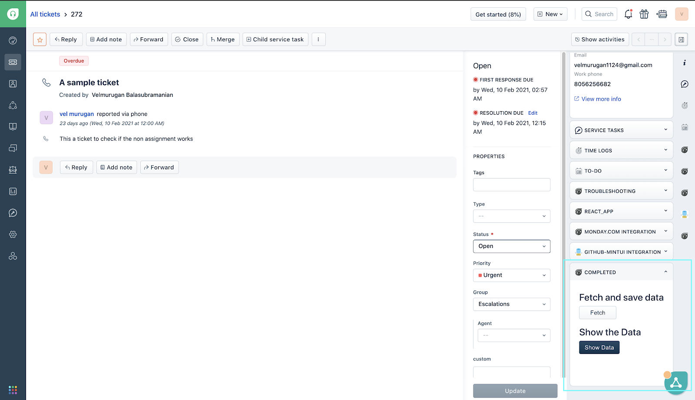
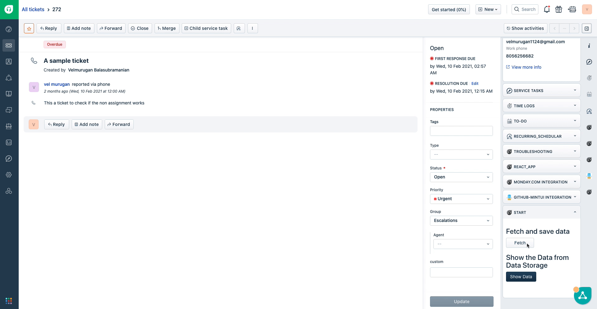
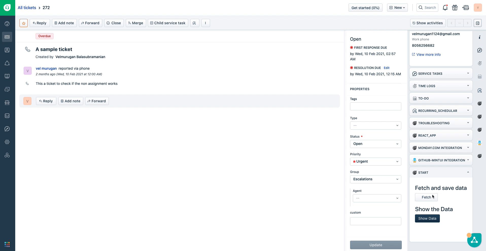
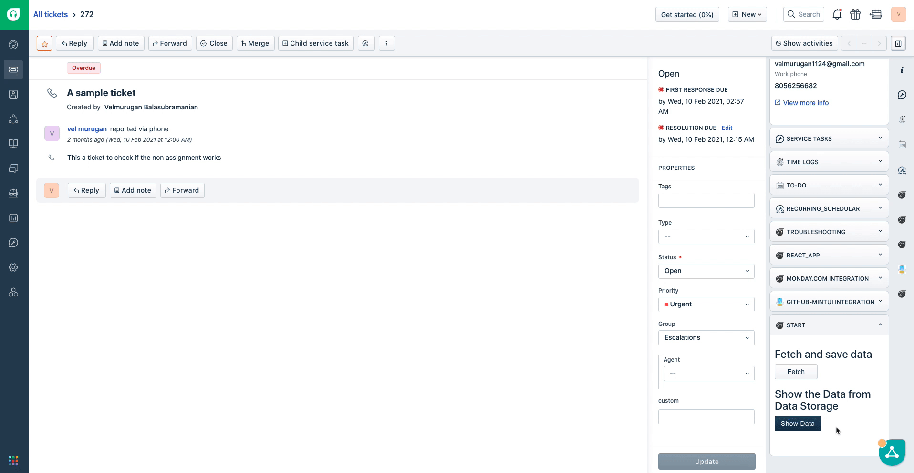

summary:This tutorial focuses on introducing you to Freshworks Data storage, a key-value data store, and Request method, an http client to make API calls. t
id: data-storage-and-request-methods
categories:freshdesk
tags:
status:Published 
authors:Velmurugan Balasubramanian
Feedback Link: https://developer.freshworks.com

# Introduction to Data Storage and Request Method. 


## Overview 

In the modern era, fetching data from a source and persisting them are vital parts of any application. In this tutorial, we’ll learn about fetching data from a third-party REST API and persisting it in the Freshworks infrastructure using the [Request method](https://developer.freshdesk.com/v2/docs/request-method/) and [Data Storage](https://developer.freshdesk.com/v2/docs/data-storage/) respectively.

### Request Method 

Request method comes built-in with the Freshworks platform. The request method is a suggested alternative over the regular  HTTP clients like `jQuery.ajax(..)` or `fetch(..)`.

There are a variety of reasons to use the Request method over a conventional HTTP clients, which are as follows,

* Request Method has the backing, support, and reliability of the freshworks developer platform.
* Request Method handles CORS out of the box.
* Request Method helps in securing sensitive information, such as API Keys or user credentials through [secure installation parameters](https://developer.freshdesk.com/v2/docs/installation-parameters/)(Iparams).

### Data Storage

The Data storage also comes built-in with the Freshworks developer platform. Freshworks data storage is a key-value based storage solution, where you can save JSON objects up to the size of 8 kb, Although there is a size restriction on objects, there is no restriction on the number of objects you can store in the Freshworks data storage.

Advantages of using Freshworks Data Storage are,

* No need to handle the cumbersome configuration of an external datastore.
* Native SDK for handling CRUD operations.

## Get Started

### What we'll build?

In this tutorial, we’ll build a fun Freshdesk app that fetches the current location(latitude and longitude) of the International space station using a free REST API. 

### Prerequisites

* Freshdesk trial account.
* The latest version of FDK.
* A text editor.
* Basic knowledge of HTML, CSS, and Javascript.
* Basic knowledge of Freshworks App development, if this is your first time developing an app for Freshworks products, It’s highly recommended that you complete the following tutorials before you start this one.
  - [Introduction to Freshworks Developer Platform](/codelabs/introduction/index.html)
  - [Build your first Freshworks app](/codelabs/freshdesk-basics/index.html)

## About the boilerplate code

### Clone the boilerplate

Once you have the prerequisites ready, clone the boilerplate from the below repository

```bash
git clone  https://github.com/freshworks-developers/request-method-and-data-storage_Freshdesk.git
```


The cloned repository will have two folders 
* `/Start` -  	Boilerplate to get started with this tutorial 
* `/Completed` -  completed demo of what we’ll be building in this tutorial

### Folder structure of the boilerplate app


The above image shows the folder structure of the boilerplate app, the functionalities of the files are as follows

* `app/index.html` - The entry point to the application and markup
* `app/scripts/app.js` - holds the app logic and included in the index.html file
* `app/styles` - Holds all the CSS and images 
* `config/iparams.json` - Holds Iparams definition. 
* `manifest.json` - manifest.json holds the metadata and definition about the platform and the app. 

To run either of the apps change the directory to the corresponding folder( /start or /completed) and run *fdk run* in the terminal to start the localhost.

The localhost should start with the messages displayed in the screenshot below


Once the localhost is started with the above message, open a ticket page and append “?dev=true” in the URL (eg: https://you_portal_name.freshdesk.com/a/tickets/1?dev=true), The app should render in the `ticket_sidebar` location as shown in the highlighted section of the below screenshot. 




## Fetch the data from Rest API

Now that we have the basics covered, let’s extend the boilerplate to build our app. 

To fetch the data from the REST API let's copy the following code snippet and place it under `//fetchData() Function Goes Here` placeholder in `app/script/app.js` file

```javascript
/**
* Function to Fetch location of International Space Station from the REST API
*
*/
function fetchData() {
 
 // API endpoint to fetch the current location of the International Space Station
 const API_BASE_URL = "https://api.wheretheiss.at/v1/satellites/25544/positions"
 
 // Timestamp for the current time to get the location of International Space Station for a specified time.
 const timestamp = new Date().getTime()
 
 // HTTP request header
 const headers = {
   "Content-Type": "application/json"
 }
 
 // Options passed to the request method, consists of header, body and other objects with multiple functionalities
 const options = {
   headers
 }
 
 // HTTP request to get the date from the 
 client.request.get(`${API_BASE_URL}?timestamps=${timestamp}&units=miles`, options)
   .then(
     function (location) {
       // Print the location object in the browser console
       alert('location of International Space Station  :-' + JSON.stringify(location));
     },
     function (error) {
       // Error handling
       handleErr(error)
     }
   );
}
```

The above code snippet fetches the data using the REST API and prints it in the browser console, let’s check if we can get the current location of the International Space Station.

### Test the feature

Let’s start the localhost and verify that our changes works as intended.


From the above GIF we can see that by clicking on the `fetch` button, we can fetch the location of the international space station successfully and display it in the notification.

## Save the Data in the Data Storage

Now that we fetched the data from the REST API, let’s persist it to the Data Storage for later use.

Copy the below code snippet under the `// saveInDataStorage function goes here` placeholder in `app/scripts/app.js`

```javascript
/**
* Function to save the location in data storage
* @param {*} data Object
*/
function saveInDataStorage(data) {
 
 client.db.set("location", data).then(
   function (data) {
     showNotify("success", "Location saved successfully in the Data Storage"); 
     console.info(data);
   },
   function (error) {
     // failure operation
     console.log(error)
   });
}
```

The above function uses the `db` method exposed by the client object to set the data in the Freshworks Data Storage.

Invoke the saveInDataStorage(location) function with the location as the parameter which we got from the request API, replace the alert message with the below code in the `fetchData(){...}` function.

```javascript
  // Invoke the saveInDataStorage(data) function to save the location in the data storage
  saveInDataStorage(location);
```

Let’s restart the localhost and test the functionality as shown in the below GIF



From the above GIF We can see that a notification is displayed to acknowledge the data is saved successfully in the data storage.

## Fetch the Data from Data Storage

We have the data saved in the Freshwoks Data Storage, the next step is to fetch the location from data storage  and display it as a notification.

```javascript
/**
* Function to fetch the location of International space station
*/
function fetchFromDataStorage() {
 client.db.get("location").then(
   function (data) {
     showNotify('success',`The location ISS from the Data Storage is Latitude: ${data.latitude} , Longitude: ${data.longitude}`)
     console.info('data', data);
   },
   function (error) {
     handleErr(error)
   });
}
```
The above code snippet fetches the location from the freshworks data storage and displays it as a notification.

Let us test if we can fetch the data from the data storage



From the above GIF we can verify that the data can be successfully fetched from the Data storage and displays it correctly as a notification.

## Recap

### What we've learned?

In this tutorial, we've learned,

✅ How to use the Request Method to fetch data from a REST API
✅ How to persist and fetch data from the freshworks data storage.

### What's next?

Now that you are familiar with the data storage, and the request method, you can expand your knowledge by,

✅ By exploring advanced data storage options to build more complex solutions backed by data storage.
✅ Use Request method to make complex API calls to Create(POST) and Update(PUT) endpoints, with authentication.
