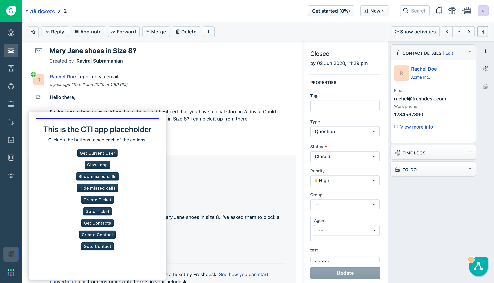
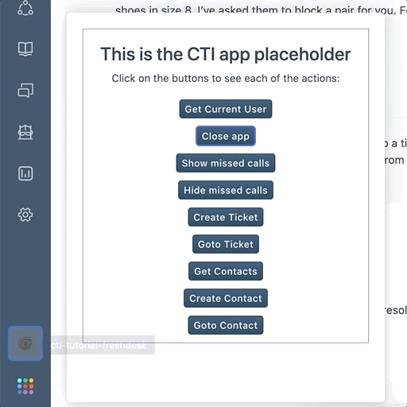
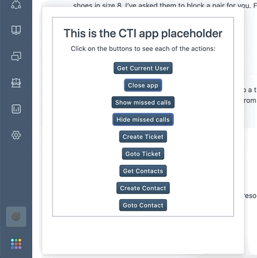
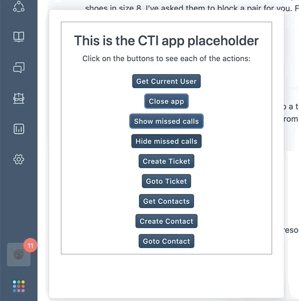
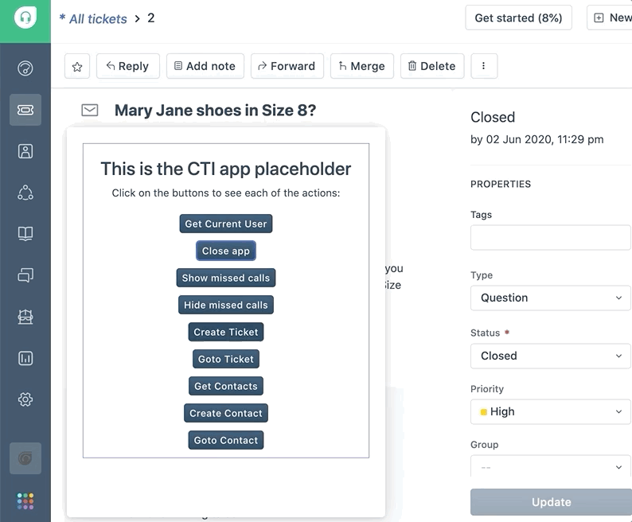

summary: This tutorial focuses on creating a Cloud-Telephony Integration (CTI) app for Freshdesk with the essentials for an ideal use-case.
id: develop-cti-app-for-freshdesk
categories: Advanced
theme: Freshdesk
tags: Freshdesk
status: Published
authors: Freshworks
Feedback Link: community.developers.freshworks.com

# Develop Cloud-Telephony Integration (CTI) app for Freshdesk
How to Write a Codelabs the right way
<!-- ---------------------------------------------------------------------------- -->

## Overview

Cloud Telephony Integration (CTI) refers to integrating a Cloud telephony service with Freshworks products. Cloud telephony is a [VoIP](https://en.wikipedia.org/wiki/Voice_over_IP) service over the cloud, and it is considered as a  replacement for conventional business telephone equipment.

For CTI apps, Freshdesk has a [dedicated placeholder](https://developers.freshdesk.com/v2/docs/app-locations/#ctiglobalsidebar), events, and interface methods that will work globally on all the pages. This allows our CTI app to make and receive calls from any page in Freshdesk.

In this tutorial, we are going to build a CTI app for Freshdesk.

## What are we going to learn?

* CTI placeholder - The location where the CTI app gets rendered on all the pages.
* Interface methods specific to CTI - It lets the app do certain actions within the page.
* Click-to-call event - This event triggers the app whenever a phone number gets clicked on certain pages.
* Navigation to a ticket or contact details page
* Create a ticket with the Request method

Take a sneak peek at the complete app that we are going to build a CTI app with all the aforementioned features.



## Prerequisites

* The latest version of Freshworks CLI installed
* A [Freshdesk](https://freshdesk.com/signup) account subscribed to Blossom or higher plan.
* Basic knowledge of HTML, CSS, and JavaScript.
* Frontend app development in Freshworks developer platform.
* Request method in Freshworks developer platform

## Setup

Clone [this application repository](https://github.com/freshworks-developers/serverless-events-freshdesk) to get started with this tutorial,

```shell
git clone https://github.com/freshworks-developers/cti-tutorial-freshdesk.git

```

* Navigate to the branch `start` to begin with the boilerplate application.
* The branch `finish` will have the complete code-base, which is worth referring to in between if and when getting stuck.

## Skeleton for a CTI app

We are going to build a CTI app through this tutorial. Take a look at the sneak peek of it.


Freshworks developer platform provides various features for its frontend apps. CTI solutions require specific features that are not commonly used in other apps. For example, by clicking on a phone number in a contact, the app should open and dial in the number to make a call.

Open the cloned app in your favorite text editor and peek into the known component of a frontend app.

### App Placeholder

* The app is opened in the `cti_global_sidebar` placeholder that is useful for CTI use cases.
* It's a specific placeholder introduced dedicatedly for CTI integration.
* At this app location, only one app can be active at a time.
* The height can be adjusted for the viewport. But, the width cannot be changed.

### Global Data Methods

Since the CTI apps load in the global sidebar location, they may require some data in all the pages such as the user who has logged in and the domain name of the Freshdesk account. The following data can be fetched from the app on all the pages.

* [loggedInUser](https://developer.freshdesk.com/v2/docs/data-methods/#loggedInUser)
* [domainName](https://developer.freshdesk.com/v2/docs/data-methods/#domainname)

We will use these data in the app where they are required.

* Data methods do not have any rate limits, so it can be fetched whenever they are required in the app.
* These data will only be updated when the complete page is reloaded again and until then, the data would not get updated even if they were originally updated through any other ways in Freshdesk.
* These data are already available to the agent using Freshdesk on the same page. So, it’s not possible or necessary to make this data hidden in the app while using them.

## Interfaces for the CTI app

Interfaces are the way the Freshworks apps can interact with the other components in the same page or the page itself. Let’s check out some of the interfaces that are specifically useful for CTI apps.

### Show App

When the app needs to be opened programmatically, this interface can be used. For example, the app may want to open the app and dial in the phone number when the agent clicks on the phone number of any contact in the ticket details page.

Copy and paste the following code snippet into the `openApp()` function to open the app programmatically.

```javascript
client.interface.trigger("show", { id: "softphone" })
     .then(function () {
       console.log(`Success: Opened the app`);
     }).catch(function (error) {
       console.error('Error: Failed to open the app');
       console.error(error);
     });
```

### Hide App

Similarly, the app would need to be closed programmatically when a certain workflow ends in the app such as call ending, deliberate minimization, etc.

Copy and paste the following code snippet into the `closeApp()` function to close the app programmatically.

```javascript
 client.interface.trigger("hide", { id: "softphone" }).then(function (data) {
   console.info('successfully closed the CTI app');
   showNotify('success', 'Successfully closed the CTI app.');
 }).catch(function (error) {
   console.error('Error: Failed to close the CTI app');
   console.error(error);
 });
```

Check it out by clicking on the **Close app** button in the app.



### Show Missed Calls

When the agent is away or unavailable to take calls, the calls might not have reached the agent from the customer. This might be stored in the third-party telephony service that can be shown to the particular agent through this interface.

Copy and paste the following code snippet to the `showMissedCall()` function to show the given missedCalls to be shown in the app widget icon.

```javascript
client.interface.trigger("show", { id: "missedCall", value: missedCalls })
   .then(function (data) {
     console.info('successfully shown missed calls.', data);
   }).catch(function (error) {
     console.error('Error: failed to show missed calls.', error);
   });
```

Checkout the missed calls being added to the app icon by clicking on the **Show missed calls** button in the app.



### Hide Missed Calls

Similar to showing the missed calls, there’s an interface method to hide it when it’s read by the agent or cleared in the third-party system.

Copy and paste the following code snippet to the `hideMissedCall()` function to hide the missedCalls from the app widget icon.

```javascript
 client.interface.trigger("hide", { id: "missedCall" })
   .then(function (data) {
     console.info('successfully hidden missed calls');
   }).catch(function (error) {
     console.error('Error: failed to hide missed calls');
     console.error(error);
   });
```

Checkout the missed calls being hidden from the app icon by clicking on the **Hide missed calls** button in the app.



All the other interfaces are also available for CTI apps. Check out them in the [Interfaces method tutorial](https://developers.freshworks.com/tutorials/codelabs/introduction-to-interface-methods) on how to use them.

## Click-to-call Event

Users expect the system to automatically call the phone numbers in any user interface upon clicking on the phone numbers. The click-to-call event feature lets the app implement a similar experience for its users.

The event `cti.triggerDialer` triggers when the user clicks on the phone number in specific pages in Freshdesk. It will provide the chosen phone number that can be used to fill in the dialer interface of the app or directly make a call to the phone number.

Copy and paste the following code snippet in the `clickToCall()` function to handle the event when a phone number is clicked on certain pages.

```javascript
 const textElement = document.getElementById("appText");

 client.events.on("cti.triggerDialer", function (event) {
   openApp();
   var data = event.helper.getData();
   textElement.innerText = `Clicked phone number: ${data.number}`;
 });
```

To test this functionality, go to the Ticket details page and click on the phone number shown in the right side Contact Details section and you can notice the app opens up and the phone number is displayed.


**Note:** Ensure the `?dev=true` query parameter to the URL is kept appended to render the app running locally.

## View Contacts

Showing all the contacts and their phone numbers in the CTI app is a common trend. The following Freshdesk API lets you view the contacts lists in the app by fetching all the existing contacts in the Freshdesk account.

Copy and paste the following code snippet in the `getContacts()` function to fetch the contacts from Freshdesk.

```javascript
 const url = 'https://<%= iparam.freshdesk_domain %>/api/v2/contacts';
 const options = {
   headers: {
     Authorization: 'Basic <%= encode(iparam.freshdesk_api_key) %>'
   }
 }
 client.request.get(url, options).then(contacts => {
   console.info('Success: Got contacts list');
   console.table(JSON.parse(contacts.response));
   return JSON.parse(contacts.response);
 }, error => {
   console.error(error);
   return reject(error);
 });
```

Checkout the contacts being printed in the browser console by clicking on the **Get contacts** button in the app.


There might be a need to create a contact if it is not available and called by the agent manually typing a phone number. The Create Contact API helps create a contact in the Freshdesk account.

Copy and paste the following code snippet in the `createContact()` function to create a contact in Freshdesk.

```javascript
 const properties = {
   name: 'contact name',
   email: 'sample2@email.com',
   phone: '+0123456789',

 }
 const url = 'https://<%= iparam.freshdesk_domain %>/api/v2/contacts';
 const options = {
   headers: {
     Authorization: 'Basic <%= encode(iparam.freshdesk_api_key) %>'
   },
   json: properties
 }
 client.request.post(url, options).then(contact => {
   console.info('Success: Created contact');
   console.info(contact.response);
 }, error => {
   console.error('Error: Failed to create contact');
   console.error(error);
 });
```

Click on the **Create Contact** button in the app to test this functionality and go to the Contacts page in Freshdesk to check the newly created contact.

If a contact is created without the agent’s knowledge, it would confuse the agents addressing the customers’ calls. So, let’s redirect the agent to the created contact page.

Copy and paste the following code snippet in the `goToContact()` function to navigate the user to the created contact details page.

```javascript
client.interface.trigger("click", { id: "contact", value: contactId })
   .then(function (data) {
     console.info('successfully navigated to contact');
   }).catch(function (error) {
     console.error('Error: Failed to navigate to contact');
     console.error(error);
   });
```

This will keep the agent informed by redirecting the agent to the created contact and taking further actions from there.

Grab the Contact ID from any of the previously created contacts and assign it to the **CONTACT_ID** constant in the `onAppActivated()` function. Next, click on the **Goto Contact** button to test this functionality and see the page navigating to the particular contact.

## Create Ticket for Calls

Every call can be recorded as a ticket for further follow-up and tracking purposes. In addition, a ticket can be automatically created after every call.

Copy and paste the following code snippet in the `createTicket()` function to create a ticket for a call.

```javascript
 const callNotes = "Alice called Bob"
 const ticketDetails = {
   email: 'sample@email.com',
   subject: 'Call with the customer',
   priority: 1,
   description: `Ticket from call. Call Notes:${callNotes}`,
   status: 2
 }
 try {
   const ticketData = await client.request.post('https://<%= iparam.freshdesk_domain %>/api/v2/tickets',
     {
       headers: {
         Authorization: '<%= encode(iparam.freshdesk_api_key) %>'
       },
       json: ticketDetails,
       method: "POST"
     });
   console.info('Successfully created ticket in Freshdesk');
   showNotify('success', 'Successfully created a ticket.');
 } catch (error) {
   console.error('Error: Failed to create a ticket in Freshdesk');
   console.error(error);
   showNotify('danger', 'failed to create a ticket. Try again later.');
 }
```

Click on the **Create Ticket** button in the app to check a ticket being created. This can be used when a new ticket is required to be created for a call.



The app can also capture call notes from the agent and save them in the ticket description. An interface can be added to make it easy for the agent to go to the ticket.

Let’s paste the following code snippet to the `goToTicket()` function to navigate to the created ticket’s page.

```javascript
 client.interface.trigger("click", { id: "ticket", value: ticketId })
   .then(function (data) {
     console.info('successfully navigated to ticket');
   }).catch(function (error) {
     console.error('Error: Failed to navigate to ticket');
     console.error(error);
   });
```

Grab the Ticket ID from any of the previously created tickets and assign it to the **TICKET_ID**

constant in the `onAppActivated()` function. Click on the **Goto Ticket** button to test this functionality and see the page navigating to the particular ticket.

## Wrap up

Awesome! We have come to the final section. You have learned a bunch of features to build a CTI app on the Freshworks Developer Platform. Refer to the complete code in the `finish` branch of the same code repository.

These are the areas that are covered in this tutorial:

1. App Placeholder
2. Global Data Methods
3. Interface methods to show/hide app and show/hide missed calls.
4. Click-to-call event
5. Get Contact List API
6. Create Contact API
7. Create Ticket API
8. Navigating to a contact/ticket page

## What’s next?

* Contact sync with product events - The contacts can be synchronized with any third-party services using Product events. This use case needs to be solved using a Serverless component of the app. Explore more about it on the [Introduction to Serverless tutorial](https://developers.freshworks.com/tutorials/codelabs/introduction-to-freshworks-serverless-apps).
* Explore other [Freshdesk APIs](https://developer.freshdesk.com/api) that could be useful
  * There are [Company APIs](https://developer.freshdesk.com/api/#companies) to create or update companies. It comes in handy to add or update contacts to any company or update the company details.
  * [Time entries API](https://developer.freshdesk.com/api/#time-entries) can be used for agent productivity purposes such as automating certain activities in the app upon certain actions like attending a call and working on the call ticket.
