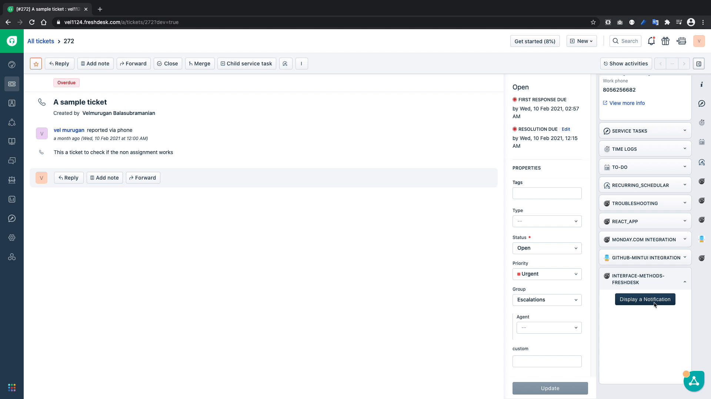
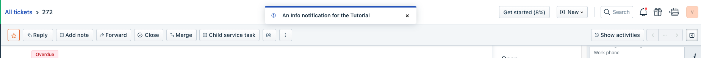
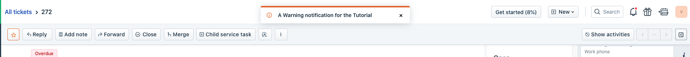
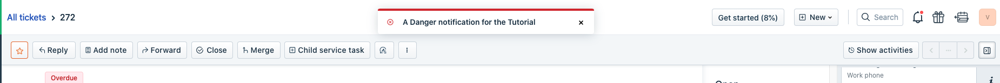
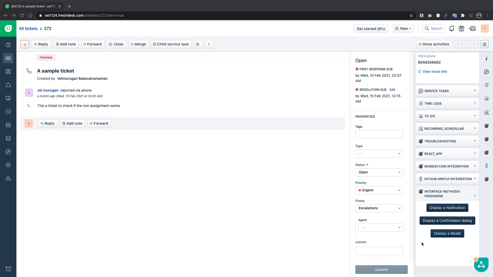
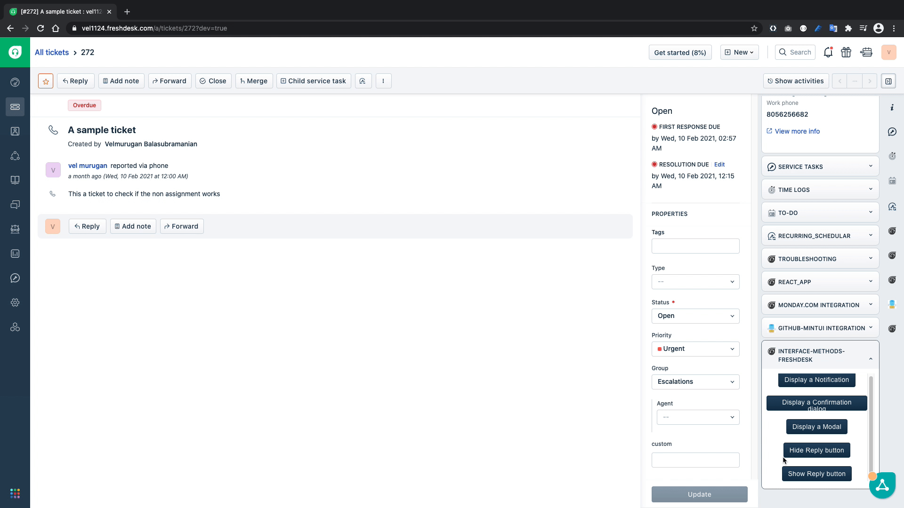
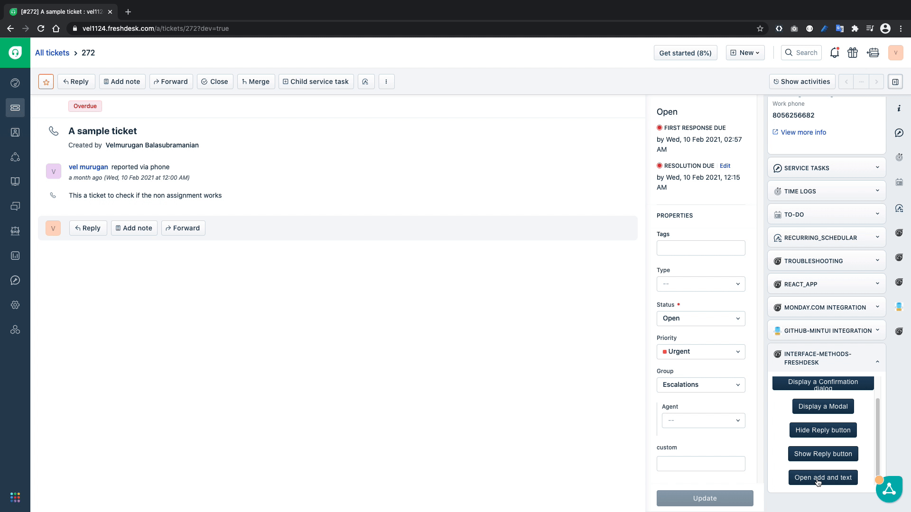

summary: This tutorial focuses on introducing you to Interface method and by building an app that utilises most commonly used interface methods.
id: introduction-to-interface-methods
categories:freshdesk
tags:freshdesk, interface
status:Published
authors:Velmurugan Balasubramanian
Feedback Link: https://developers.freshworks.com

# Introduction to Interface Methods.

<!-- ---------------------------------------------------------------------------- -->

## Overview

### Interface Methods

A Freshworks app loads in an iframe inside the product, so your app will not have control over the Product/Parent window’s interface.

An Interface method can be used to,

* Display user interface elements in the parent window like
  - Display a modal on the window, to provide extra real estate to the app.
  - Display a notification on the window
* Manipulate the existing UI elements like
  - Show or Hide an interface element
  - Set/modify values to the field in the User Interface element like text value in the text editor or cc field in the reply editor.

The interface method can be classified into two major categories, 

* Global Interface methods 
	- These interfaces methods are available in all app locations
* App location specific Interface methods
	- These interface methods, like the name suggests are specific to its placeholders. 

Positive
: The interface methods varies based on the products and the app location, refer to the [documentation](https://developer.freshdesk.com/v2/docs/interface-methods/) to learn about the list of all avilable Interface methods and understand their functionality.

## Get Started

### What we'll build today?

In this tutorial instead of building an app towards a goal, we are going to build an app that explores a list of commonly used interface methods and their available features in a app. 
### Prerequisties

- Freshdesk trial account
- The latest version of FDK
- A text editor
- Basic knowledge of HTML, CSS, and Javascript
- Basic knowledge of Freshworks App development, if this is your first time developing an app for Freshworks products, It’s highly recommended that you complete the following tutorials before you start this one.
  - [Introduction to Freshworks Developer Platform](/codelabs/introduction/index.html)
  - [Build your first Freshworks app](/codelabs/freshdesk-basics/index.html)

### Clone the boilerplate app

To get started with tutorial, let's clone the boilerplate app from the following repository,

```bash
git clone https://github.com/freshworks-developers/interface-methods-freshdesk.git
```

Or if you feel adventurous, you can create a new Freshdesk app and continue with the tutorial.

## Show Notifications

A `showNotify` interface method can be used to display any vital information to the end user.  

To display a notification, copy the following snippet and paste it in `app/scripts/app.js`

```javascript
/**
 * Function to display Notification
 */
function showNotification() {
	client.interface
		.trigger("showNotify", {
			type: "success",
			message: "A notification for the Tutorial",
			/* The "message" should be plain text */
		})
		.then(function (data) {
			console.info("Notification displayed");
			console.info(data);
		})
		.catch(function (error) {
			console.error("Unable to show Notification");
			console.error(error);
		});
}
```

The above function uses the interface method exposed by the client object, to trigger a UI element, in this case a notification message.

Now that we have the `showNotification(){..}` function in place, let’s invoke the `showNotification(){..}` from `index.html` by pasting the following snippet inside body of the `index.html` file

```html
<fw-button onclick="showNotification()">Display a Notification</fw-button>
```

This snippet in the index.html will invoke the `showNotification(){..}` we defined in the earlier.

Let us test if our code can show the notification on to the browser window



From the above GIF we can confirm that we can display the notification on the browser window.

We can define the type of notification that we want to display like success, warning, or error, which are differentiated by green, yellow, or red color respectively(reference screenshots below)

Info


Warning


Danger


## Show Confirmation Dialog

A `showConfirm` Interface method can be used in the scenarios in which a confirmation dialog has to be shown to the enduser and requires confirmation whether to proceed or not with the intended action.

To show a confirmation dialog, copy the following code and paste it in `app/scripts/app.js`

```javascript
/**
 * Function to display a confirmation dialog
 */
function showConfirmation() {
	client.interface
		.trigger("showConfirm", {
			title: "Sample Confirm",
			message: "Are you sure you want to close this ticket?",
			saveLabel: "save",
			cancelLabel: "ignore",
		})
		.then(function (data) {
			if (data.message === "save") {
				alert("You clicked Save");
			}
			if (data.message === "ignore") {
				alert("You clicked ignore");
			}
		})
		.catch(function (error) {
			console.error("Unable to show confirmation dialog");
			console.error(error);
		});
}
```

The `showConfirmation(){...}` function uses the interface method to show a confirmation dialog to get the user input whether to save or cancel and then based on the given input it displays an alert.

Negative
: _Note_ : you can replace the alerts with a different action in your app if you prefer to do so.

```html
<fw-button onclick="showConfirmation()"> Display a Confirmation dialog </fw-button
>
```


From the above GIF we can see that confirmation dialogue is working as intended.

## Show Modal

A Modal can be invoked using the `showModal` Interface Method, a modal is usually used when the current app location doesn't have enough real estate to display the intended information. 

Unlike notification and confirmation dialog we need an html template file to show as a modal, so let’s create an html file called `modal.html` inside the app folder.

once the file is created copy the following code into the newly created html file

```html
<!DOCTYPE html>
<html lang="en">
	<head>
		<meta charset="UTF-8" />
		<meta http-equiv="X-UA-Compatible" content="IE=edge" />
		<meta name="viewport" content="width=device-width, initial-scale=1.0" />
		<title>Modal</title>
	</head>
	<body>
		<h3>This is a modal opened using interface method</h3>
	</body>
</html>
```

Now that we have a template for the modal ready, let us copy the `showModal(){..}` function in `app/scripts/app.js` to open a modal.

```javascript
/**
 * Function to show a modal
 */
function showModal() {
	client.interface
		.trigger("showModal", {
			title: "Sample Modal",
			template: "modal.html",
		})
		.then(function (data) {
			console.info("modal displayed");
			console.info(data);
		})
		.catch(function (error) {
			console.error("Unable to display modal");
			console.error(error);
		});
}
```

Let’s invoke the `showModal(){..}` function in the `index.html` file and test it out

```html
<fw-button onclick="showModal()">Display a Modal</fw-button>
```



Now that we’ve covered how to display interface elements on the window, let us explore how to show or hide a user interface elements in the screen.

## Show/Hide the existing Interface

In this section of the tutorial we will learn how to hide the reply button from the ticket details page, and then show the same by following the drill again, copy the function to `app/scripts/app.js`, invoke it in `index.html` and test it out.

#### app.js

```javscript
/**
* Function to hide the reply button in Ticket details page
*/
function hideReply() {
 client.interface.trigger("hide", { id: "reply" })
   .then(function (data) {
     console.info('Reply button hidden');
     console.info(data);
   }).catch(function (error) {
     console.error('Unable to hide the reply');
     console.error(error);
   })
}

/**
* Function to show the reply button in Ticket details page
*/
function showReply() {
 client.interface.trigger("show", { id: "reply" })
   .then(function (data) {
     console.info('Reply button shown');
     console.info(data);
   }).catch(function (error) {
     console.error('Unable to show the reply');
     console.error(error);
   })
}
```
The `hideReply(){..}` function uses the interface method to hide the reply button and the `showReply(){...}` function to show the reply button.

#### index.html

```html
     <fw-button onclick="hideReply()">Hide Reply button</fw-button>
     <fw-button onclick="showReply()">Show Reply button</fw-button>
```

#### Output


From the above GIF, we can confirm that we can hide the `reply` button and then show the same using the Interface method.

## Set values of fields using the Interface method

In this section of the tutorial we will learn how to set values to editable fields in the ticket details page, in this case a reply editor.

Copy the following code snippets to the `app/scripts/app.js` and `index.html`

#### app.js
```javascript
/**
* Function to Open the reply editor and insert custom text
*/
function openAndEdit() {
 client.interface.trigger("click", { id: "reply", text: "A sample text inserted from the app" })
   .then(function (data) {
     console.info('editor opened and text updated ');
     console.info(data);
   }).catch(function (error) {
     console.error('editor opened and text updated ');
     console.error(error);
   });
}
```

#### index.html
```html
     <fw-button onclick="openAndEdit()">Open add and text</fw-button>
```

In the above code snippet, the `openAndEdit(){...}` function simulates the reply click to open the reply editor and inserts the text `A sample text inserted from the app` in the editor. Let’s test it out.



The above GIF confirms that our code works as intended and inserts the text successfully into the text editor. 
## Recap

### What we've learned?

In this Tutorial we learned, 

✅ How to display notification 
✅ How to display confirmation dialogs
✅ How to display a modal
✅ How to show and hide a button in ticket_details page
✅ How to insert a text in the reply text editor. 

### What's next?

After familiarizing yourself with the commonly used Interface methods, you can visit the [documentation](https://developer.freshdesk.com/v2/docs/interface-methods/) to explore new Interface methods and build cool new projects with the learning.


