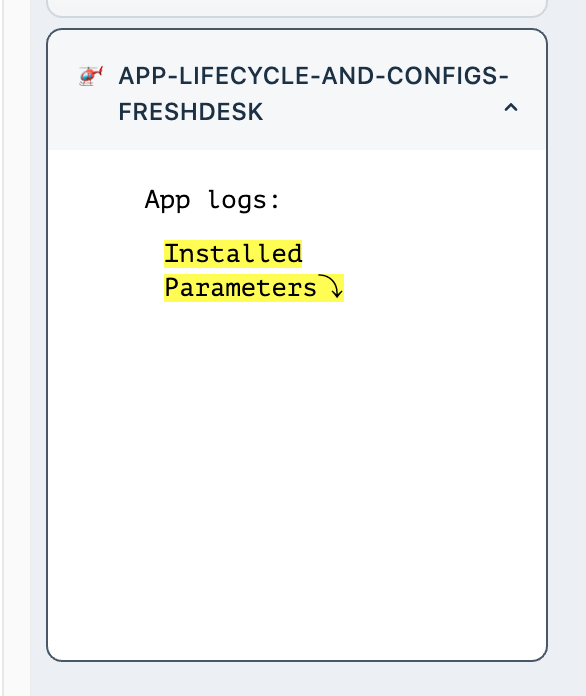
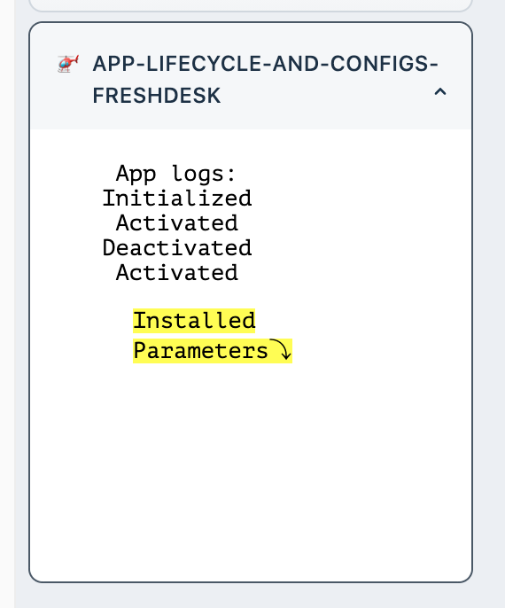
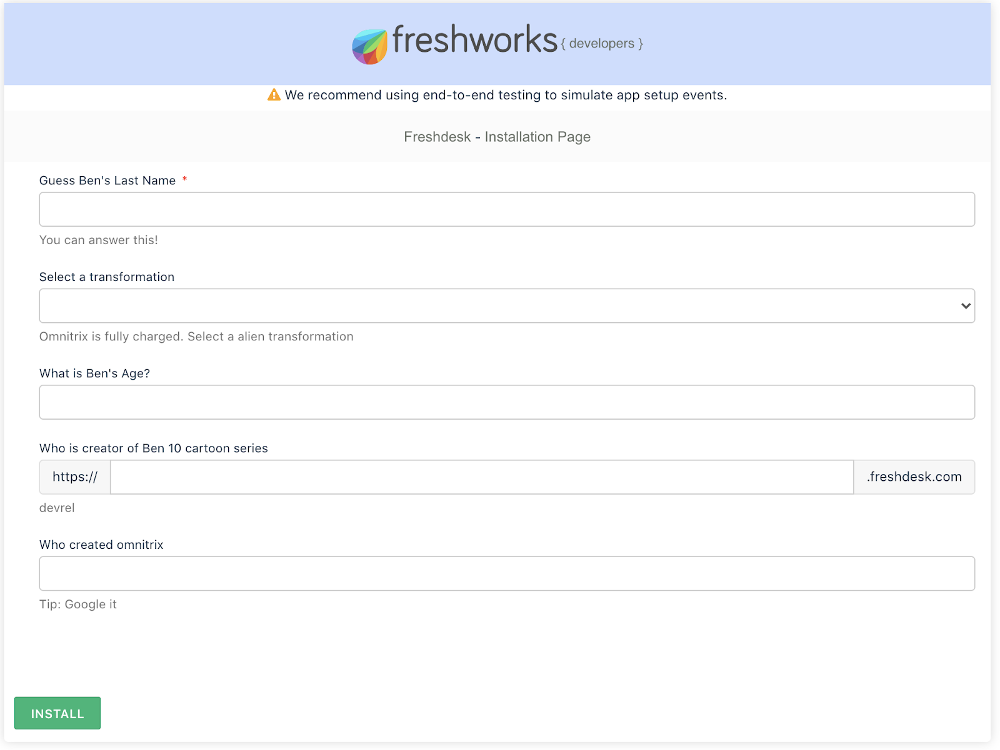
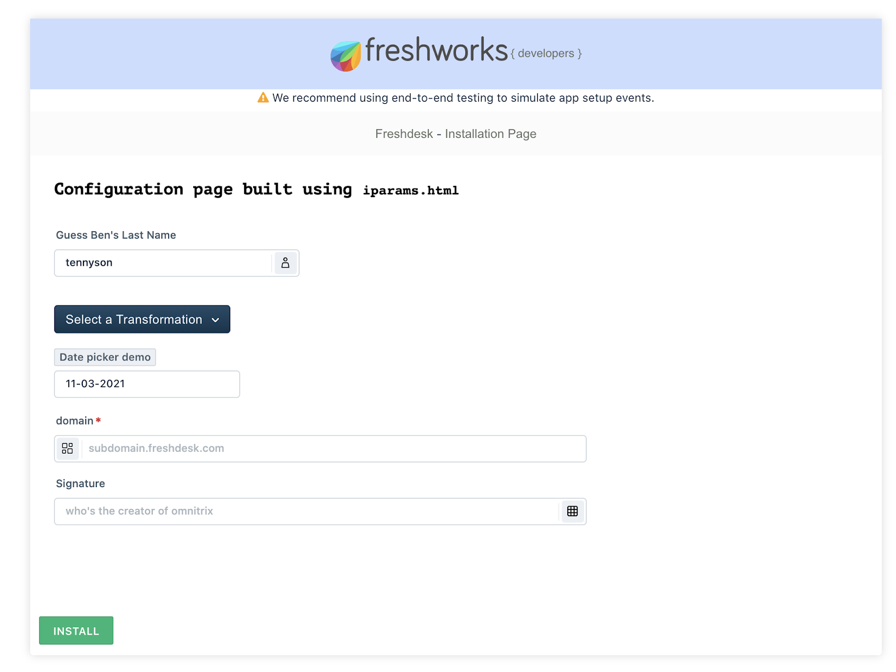

summary: Get an intuitive understanding on app lifecycle in Freshdesk and try writing UI using configuration features
id: lifecycle-and-configuration-page-freshdesk
categories: Foundations
tags: Foundations
status: Published
authors: Saif Ali Shaik
Feedback Link: https://community.developers.freshworks.com/c/ideas/

# Lifecycle and Configuration Page

## Introduction

An app served by Freshworks developer platform will have app lifecycle event listeners to which callbacks can be registered with. In this tutorial, we will explore app lifecycle events to use in favour of app's requirements.

On the other hand, apps might also require a configuration page. Users can configure settings related to the app before and after the app is installed. We will explore two ways how you can build those configuration pages.

### What we'll learn

- Building configuration pages using iparams.json
- Consuming the installed information by the user during and beyond the app installation.
- Managing secure information to be kept private from the browser

### What we'll need

1. A Freshdesk trial account on Chrome web browser
2. Freshworks CLI
3. A code editor
4. Basic knowledge of HTML, CSS, Javascript, CLI and Browser DevTools
5. The Sample Code (See Get Set Up)
6. Freshdesk developer documentation open as you follow along.

### What we'll do

You will start by writing code for app lifecycle events for one of the app placeholders. Later we will build a configuration page for the same app both with a low-code way (ft. iparams.json ) and regular way (ft. iparams.json) in different git branches.

### Prerequisite Knowledge

1. How users use Freshdesk.
2. Have [walked through code](https://developers.freshdesk.com/v2/docs/your-first-app/#code_walkthrough) of an Freshworks App
3. Have completed the [quick start section](https://developers.freshdesk.com/v2/docs/quick-start/) of Freshdesk documentation
4. Have used an UI library before and understands [Crayons UI components](https://crayons.freshworks.com/components/)

## Get Set Up

Let’s clone the starting point

```sh
git clone https://github.com/freshworks-developers/app-lifecycle-and-configs-freshdesk.git
```

Or you can also

<button>
[Download a Zip](https://github.com/freshworks-developers/app-lifecycle-and-configs-freshdesk/archive/start.zip)
</button>

### Verify

1. Open the started code in code editor
2. Open shell and run `> fdk run`
3. You should notice the app is being served at `localhost:10001`
4. Login to Freshdesk trial account and pay attention to four placeholders after [appending ?dev=true at every page](https://developers.freshdesk.com/v2/docs/quick-start/#test_your_app).

After you open the source code, a bunch of HTML, CSS and JS files can be found. These files render your app in [ticket_sidebar placeholder](https://developers.freshdesk.com/v2/docs/app-locations/#ticket_details_page).



At this point the following are apparent in the app,

1. It contains text `App logs`. You will write code to observe app lifecycle events. When ever one occurs, the app displays the event that has occurred.
2. There’s also text `Installed Parameters`. For now, just ignore it. We will discuss this later as we explore configuration pages.

## Overview

HTML, CSS and JS files that you wrote will be rendered in an [inline frame ](https://developer.mozilla.org/en-US/docs/Web/HTML/Element/iframe)(iframe) provided by Freshdesk in [supported placeholders](https://developers.freshdesk.com/v2/docs/app-locations/#).

- App life cycle events are all about callbacks that the app can register when the app is initialized, activated or deactivated.
- While configuration pages are separate from web pages those load inside of the iframe provided by Freshdesk. These are rendered inside Freshdesk’s app management page.

## App Life Cycle Events

Let’s start by opening `app.js` in `app/scripts. `The existing code invokes `renderApp(){..}` which is not defined yet. Let’s define it and understand what is happening.

Add following code in `app.js`

```js
function renderApp() {
  app
    .initialized()
    .then(function onInit(_client) {
      window['client'] = _client;
      appLifeCycleEvent('Initialized');

      client.events.on('app.activated', () => {
        appLifeCycleEvent('Activated');
      });

      client.events.on('app.deactivated', () => {
        appLifeCycleEvent('Deactivated');
      });
    })
    .catch(console.error);
}

function appLifeCycleEvent(state) {
  return notes.insertAdjacentHTML('beforebegin', `<li>${state}</li>`);
}
```

1. Within `renderApp(){..} `we try to access `'app'`. Platform attaches the `app` to the `window` of`<iframe>`.
2. Using `app` object,` initialized()` is invoked. `app.initialized()` returns a promise object which resolves with the `client` object.
3. The `client` object can observe few events. We can register a callback when the app is activated by passing the ‘`app.activated'` argument and corresponding callback function.
4. In the above code snippet we are simply writing some text to the app’s UI.
5. See `appLifeCycleEvent(..)` invoked in the callbacks registered with `'app.activated'` and`'app.deactivated'.`
6. Interestingly, the JavaScript within `onInit(_client){..}` would be executed when app is initialized.
7. The initialized, activated and deactivated events of an app lifecycle are triggered at different times in the different app placeholders. Refer to the [documentation](https://developers.freshdesk.com/v2/docs/app-lifecycle-methods/) for specific details.

For the current app being served in `ticket_sidebar` the `app.initialized()` is invoked when Freshdesk page loads for the first time, activate is invoked when user clicks and opens the app explicitly. The deactivate is fired when the user moves to a different ticket in the ticket details page.



If you have done it right, the above is how your app would add text to the UI.

[Switch to this checkpoint](https://github.com/freshworks-developers/app-lifecycle-and-configs-freshdesk/tree/app-life-cycle)

## Build Configuration page with iparams.json

Before you proceed with this section, try installing any free app (example: [signature management app](https://www.freshworks.com/apps/freshdesk/signature_management_app)) from the [marketplace](https://www.freshworks.com/apps/freshdesk/) to your Freshdesk Trial account. As the installation process of the app begins, Freshdesk users will be required to fill in details depending on requirements of the app.

Let’s go ahead and build one such configuration page. Everything related to configuration page would be under `config/` directory

Open `iparams.json` and replace the following JSON configuration with the file contents,

```json
{
  "hero": {
    "display_name": "Guess Ben's Last Name",
    "description": "You can answer this!",
    "type": "text",
    "required": true,
    "visible": true,
    "secure": false,
    "regex": {
      "alphanumeric": "^[a-zA-Z0-9_]*$",
      "alphanumeric-error": "Name validation failed"
    }
  },
  "omnitrix": {
    "display_name": "Select a transformation",
    "type": "dropdown",
    "options": [
      "Cannonbolt",
      "Heatblast",
      "Four Arms",
      "Grey Matter",
      "Jetray",
      "Humungousaur",
      "Slapback",
      "Goop",
      "Way Big",
      "Diamond Head"
    ],
    "default_value": "Grey Matter",
    "required": false,
    "description": "Omnitrix is fully charged. Select a alien transformation"
  },
  "age": {
    "display_name": "What is Ben's Age?",
    "type": "number"
  },
  "creatorDomain": {
    "display_name": "Who is creator of Ben 10 cartoon series",
    "type": "domain",
    "description": "devrel",
    "type_attributes": {
      "product": "freshdesk"
    }
  },
  "signature": {
    "display_name": "Who created omnitrix",
    "description": "Tip: Google it",
    "type": "text",
    "events": [
      {
        "change": "checkSignature"
      }
    ]
  }
}
```

Before we discuss the contents of this file specifically, all that’s required to for the UI to be automatically rendered. Let’s quickly go ahead and re-run the app.

```sh
❯ fdk run
Starting local testing server at http://*:10001/
Append 'dev=true' to your Freshdesk account URL to start testing
e.g. https://domain.freshdesk.com/a/tickets/1?dev=true
Quit the server with Control-C.
To test the installation page, visit - http://localhost:10001/custom_configs
```

Notice there is a new route on :`10001` with path `custom_configs`. Go ahead and open it.



You will find a web page like above being rendered. This is based on the JSON you’ve just filled out.

1. There are different types of fields called installation parameters available for the developers to quickly build the UI. [See what are all available](https://developers.freshdesk.com/v2/docs/installation-parameters/).
2. All fields mentioned are playfully taken from the context of [Ben 10](https://en.wikipedia.org/wiki/Ben_10).

If you had taken a closer look at `assets/iparams.js `you’d notice the following code,

```js
function checkSignature(sign) {
  return sign.toLowerCase() === 'azmuth' ? '' : 'Wrong signature';
}
```

Above is a callback function that allows you to observe UI events and invoke the callback. For example, in the current case `signature` is a field which can be validated again with the `checkSignature(){..}` function. If the return value of `checkSignature` is an _empty string_ the Installation proceeds. Else, the app will throw an error and requests the user to enter expected details by the app. [Learn more about this dynamic behavior in the docs](https://developers.freshdesk.com/v2/docs/installation-parameters/#dynamic_install_page).

[Reach this checkpoint](https://github.com/freshworks-developers/app-lifecycle-and-configs-freshdesk/tree/iparams-json)

## Build Configuration page with iparams.html

Freshworks Apps also support the regular HTML, CSS and JS to be used to build a configuration page. But Either iparams.json or iparams.html to be used at the same time. On the same grounds, let’s [rollback to the app lifecycle events checkpoint](https://github.com/freshworks-developers/app-lifecycle-and-configs-freshdesk/tree/app-life-cycle) and start building the same page using `iparams.html`

```sh
❯ git checkout app-life-cycle
Switched to branch 'app-life-cycle'
Your branch is up to date with 'origin/app-life-cycle'.
```

<aside class="positive">
If you see any errors while switching the branch, Try running
<code>
❯ git stash
Saved working directory and index state WIP on start: X80XXXX``
  </code>
This temporarily hides all the changes you've made while working on start branch and allows to switch smoothly to app-life-cycle branch
</aside>

Delete everything that is already existing under `config/` directory and create `iparams.html` , `assets/iparams.js` , `assets/iparams.css`. Let’s discuss what’s different in this approach,

Write following code in recently createdSee `iparams.html` file

```html
<!DOCTYPE html>
<html lang="en">
  <head>
    <meta charset="UTF-8" />
    <meta http-equiv="X-UA-Compatible" content="IE=edge" />
    <meta name="viewport" content="width=device-width, initial-scale=1.0" />
    <link rel="stylesheet" href="./assets/iparams.css" />
  </head>
  <body>
    <main>
      <h3>
        Configuration page built using
        <code>iparams.html</code>
      </h3>
      <fw-input
        label="Guess Ben's Last Name"
        icon-right="contact"
        placeholder="Try to google search"
        autocomplete="on"
        maxlength="25"
        class="text-field"
      ></fw-input>

      <fw-dropdown-button label="Select a Transformation" class="select-alien">
        <div slot="dropdown-options">
          <option id="1" value="Cannonbolt">Cannonbolt</option>
          <option id="2" value="Heatblast">Heatblast</option>
          <option id="3" value="Four Arms">Four Arms</option>
          <option id="4" value="Grey matter">Grey matter</option>
          <option id="5" value="Jetray">Jetray</option>
          <option id="6" value="Humungousaur">Humungousaur</option>
          <option id="7" value="Slapback">Slapback</option>
          <option id="8" value="Goop">Goop</option>
          <option id="9" value="Way Big">Way Big</option>
          <option id="10" value="Diamond Head">Diamond Head</option>
        </div>
      </fw-dropdown-button>

      <section class="date-domain">
        <fw-label value="Date picker demo" color="grey"></fw-label>
        <fw-datepicker placeholder="range" mode="single date" class="datepicker"></fw-datepicker>
        <fw-input
          required="true"
          type="text"
          icon-left="items"
          label="domain"
          size="30"
          placeholder="subdomain.freshdesk.com"
          class="domain"
        ></fw-input>

        <fw-input
          label="Signature"
          icon-right="grid"
          placeholder="who's the creator of omnitrix"
          autocomplete="on"
          maxlength="25"
          class="sign"
        ></fw-input>
      </section>
    </main>
  </body>
  <script src="./assets/iparams.js"></script>
  <script>
    let selectedVal = document.querySelector('.select-alien');
    let selectedDate = document.querySelector('.datepicker');
    let domain = document.querySelector('.domain');
    let nameField = document.querySelector('.text-field');
    let signature = document.querySelector('.sign');

    function postConfigs() {
      return {
        transformation: selectedVal.value,
        domain_url: domain.value,
        name: nameField.value,
        date: selectedDate.value
      };
    }

    function getConfigs({ date, name }) {
      selectedDate.value = date;
      nameField.value = name;
      return;
    }

    function validate() {
      if (signature.value == 'azmuth') return true;
      else return true;
    }
  </script>
  <script src="https://static.freshdev.io/fdk/2.0/assets/fresh_client.js"></script>
  <script type="module" src="https://unpkg.com/@freshworks/crayons/dist/crayons/crayons.esm.js"></script>
  <script nomodule src="https://unpkg.com/@freshworks/crayons/dist/crayons/crayons.js"></script>
</html>
```

1. The UI is built using [Crayons](https://crayons.freshworks.com/components/). Parts those are interesting to us are those within the `&lt;script>` tag. You will notice` postConfigs(){..}` , `getConfigs(..){..}` and `validate(){..}. `
2. Each of these methods is mandatory and has purpose. `postConfigs(){..}` ensures to pick the inputs entered by the user and sends to the platform.
3. `getConfigs(..){..}` is used to populate the fields. If not used, User opens the configuration page with blank fields every single time. It is not user friendly to require users to fill in the fields again.
4. `validate(){..}` is used to validate certain fields so that the app can decide to proceed or halt the installation or change in app configuration.



Above is the checkpoint screenshot of the simulated configuration page.

[See the source code at this checkpoint](https://github.com/freshworks-developers/app-lifecycle-and-configs-freshdesk/tree/iparams-html)

[Check the documentation](https://developers.freshdesk.com/v2/docs/custom-installation-page/) for complete details as reference when you start building for your apps!

## Wrapping up

The app lifecycle events are based on the behaviour of the placeholder.

Configuration pages that are discussed in this tutorial will help you if they are consumed by the app. But these configuration pages are capable of securing sensitive information being exposed in the browser by using Request Method. Refer to Request Method to learn more on those capabilities.

Congratulations on completing this tutorial!
