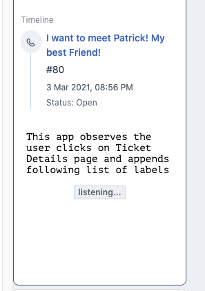
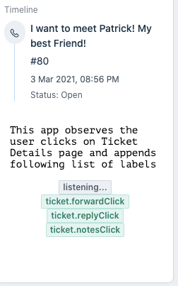

summary: Learn how to observe events on Freshdesk UI and register callbacks
id: events-methods-freshdesk
categories: Freshdesk, Serverless
tags: freshdesk, serverless, backend-events
status: Published
authors: Saif Ali Shaik

# Events Methods

## Introduction

Duration: 3

Events Method allows an App to know events happening in the Freshdesk UI and respond as needed. Let’s learn about how you can consume them to power your next app.

### What we’ll learn

- Understand what Events Methods are.
- What are different types of events methods
- How you can consume them into your app

### What we’ll need

1. A Freshdesk trial account on Chrome web browser
2. Freshworks CLI
3. A code editor
4. Basic knowledge of HTML, CSS, Javascript, CLI and Browser DevTools
5. The Sample Code (See Get Set Up)

### What we’ll do

You will explore this feature by writing some simple code to capture a few UI events in a few [app placeholders](https://developers.freshdesk.com/v2/docs/app-locations/) and explore writing code yourself.

### Prerequisite Knowledge

1. How users use Freshdesk.
2. [Available placeholders](https://developers.freshdesk.com/v2/docs/app-locations/) for apps.
3. Have [walked through code](https://developers.freshdesk.com/v2/docs/your-first-app/#code_walkthrough) of an Freshworks App

## Get Set Up

Duration: 4

Let’s start learning about events methods by going ahead and downloading sample code. It contains everything you need to just focus on learning and understanding events methods.

Current tutorial is an App running on Freshdesk.

```sh
git clone https://github.com/freshworks-developers/events-methods-freshdesk.git
```

Or you can also

<button>[Download zip file](https://github.com/freshworks-developers/events-methods-freshdesk/archive/start.zip)</button>

### Verify

1. Open the starter code in code editor
2. Open shell and run `> fdk run`
3. You should notice the app is being served at `localhost:10001`
4. Login to Freshdesk trial account and pay attention to four placeholders after [appending ?dev=true at every page](https://developers.freshdesk.com/v2/docs/quick-start/#test_your_app).

After you open the source code, a bunch of HTML, CSS and JS files can be found. These are essentially web pages rendered in 3 app [placeholders](https://developers.freshdesk.com/v2/docs/app-locations/).

1. Two of them render in Ticket Details page
2. One will render on the New Ticket page.

## Overview

Duration: 1

You can observe events that occur in the Freshdesk UI and register a callback with events methods.

`client.events.on("<argument>", callback[,options])` - takes in a callback which will be invoked when desired event occured.

Events method can observe 3 types of events

1. Click Events
2. Change Events
3. Intercept Events

## Click Events

Duration: 3

Register a callback (defined by you) when a user clicks a button or dropdown on Freshdesk UI.

Let’s see this in action. Run the following command in the Terminal.

```sh
❯ fdk run
Starting local testing server at http://*:10001/
Append 'dev=true' to your Freshdesk account URL to start testing
e.g. https://domain.freshdesk.com/a/tickets/1?dev=true
Quit the server with Control-C.
```

Freshworks CLI serves your app to the browser on port `:10001`. In the Freshdesk account, append the URL with `?dev=true` to find the app running on the global sidebar at CTI app location.


At this step, the app simply renders some text and a [label](https://crayons.freshworks.com/components/label/).

Let’s go ahead and[ and write code](https://github.com/freshworks-developers/events-methods-freshdesk/blob/c2123148bbb444fbb4a68739cfc3fa55e14963c0/app/scripts/cti.js#L20) to use events method inside of `phoneClickListener` callback function in `cti.js` as follows:

```js
client.events.on('cti.triggerDialer', function renderPhoneNumber(event) {
  const { number } = event.helper.getData();
  const label = document.querySelector('.spotlight');
  label.setAttribute('value', `Phone Number: ${number}`);
  label.setAttribute('color', `green`);
});
```

See what is happening,

1. `cti.triggerDialer` argument is passed to this method along with a named function `renderPhoneNumber`
2. `renderPhoneNumber `picks up the phone number on which the user has clicked and renders to the app’s UI.
3. `The event `argument is available within the callback function.
4. `event.helper.getData() `returns the phone number in a JS Object with the phone number needed for the app.
5. The rest would simply use the number and add phone number to UI each time the number is clicked.

Open the any ticket details page, and click a phone number in a widget named contact details. As soon as the phone number is clicked, the app can access the same phone number. Do not forget to append `?dev=true` query parameter to the URL to load the locally run app.


The argument `cti.triggerDialer` is globally available to be passed to events method across the placeholders. However, there are more. See [click events in Ticket Details Page](https://developers.freshdesk.com/v2/docs/events-methods/#ticket_details_page_methods).

On the same ticket details page, you might have noticed an app rendered in `ticket_requester_info` placeholder.



Let’s keep going to observe more events in the ticket details page.

Open `tkt_req_info.js` and [start writing following code in eventsInTktDetailsPage](https://github.com/freshworks-developers/events-methods-freshdesk/blob/c2123148bbb444fbb4a68739cfc3fa55e14963c0/app/scripts/tkt_req_info.js#L19):

```js
const spotlight = document.querySelector('.spotlight');

let clickEvents = [
  'ticket.replyClick',
  'ticket.sendReply',
  'ticket.forwardClick',
  'ticket.conversationForward',
  'ticket.forward',
  'ticket.notesClick',
  'ticket.addNote',
  'ticket.closeTicketClick',
  'ticket.deleteTicketClick',
  'ticket.previousTicketClick',
  'ticket.nextTicketClick',
  'ticket.startTimer',
  'ticket.stopTimer',
  'ticket.updateTimer',
  'ticket.deleteTimer'
];
clickEvents.forEach(function register(click) {
  client.events.on(click, function writeToDOM(event) {
    spotlight.insertAdjacentHTML('afterend', `<fw-label value="${click}" color="green"></fw-label>`);
  });
});
```

Let’s understand what above code does,

1. Previously, we passed `cti.triggerdailer` as an argument to register a callback. Similarly, above code registers all the ticket click events to single callback.
2. This app observes all the ticket events that are supported by Freshdesk and renders the same information to the App's UI.
3. An array labelled `clickEvents` holds all the arguments.
4. For Each argument in an array, registers `writeToDOM(event){..}` callback which appends a label on the UI.



Pat yourself for reaching this point! If you are stuck somewhere, you can get back on track by switching [click-events](https://github.com/freshworks-developers/events-methods-freshdesk/tree/click-events) branch!

## Intercept Events

Duration: 4

Let’s keep going.

Now that you know how to observe the click events, the app can also decide to allow or prevent that event from happening. For example, on certain conditions the app might prevent the ticket being closed.

Head to` tkt_req_info.js` and add the follow code:

```js
let interceptEvents = {
  prevent: ['ticket.closeTicketClick', 'ticket.deleteTicketClick'],
  allow: ['ticket.propertiesUpdated', 'ticket.sendReply']
};

interceptEvents['prevent'].forEach(function registerCb(click) {
  client.events.on(click, preventClickEvent, { intercept: true });

  function preventClickEvent(event) {
    let eventName = event.type;
    const row = `<fw-label value="${eventName.slice(7)} prevented" color="red"></fw-label>`;
    spotlight.insertAdjacentHTML('afterend', row);
  }
});

interceptEvents['allow'].forEach(function registerCb(click) {
  client.events.on(click, allowClickEvents);

  function allowClickEvents(event) {
    let eventName = event.type;
    const row = `<fw-label value="${eventName.slice(7)} allowed" color="red"></fw-label>`;
    spotlight.insertAdjacentHTML('afterend', row);
    event.helper.done();
  }
});
```

1. Most of the code should seem familiar to you in the previous step about registering a callback for every click event.
2. Notice how `{intercept: true}` is passed as an argument.
3. This argument prevents the event from happening and invokes the callback passed. In this case, `preventClickEvent`
4. Also, notice `event.type. `It returns the which click event just happened in the `registerCb(event){..}` ‘s execution context. In other words, that’s how your callback would know which event caused it to be invoked.
5. `event.helper.done()` decides the current event should continue. In this case, appending _allowed_ labels to the UI.
6. For example, if you have the same callback registered based on `event.type` you can allow the original event to continue or prevent the original event from happening.

On playing around changing some properties and trying out those events, you’ll see tags appended.


See the [source code](https://github.com/freshworks-developers/events-methods-freshdesk/tree/intercept-events) at this step!

## Change Events

Duration: 3

On Freshdesk users change the **status**, **priority**, **group** and so on frequently. App can also observe those events and let the callback function you pass know old and new values for a given ticket property. For example, **priority**
was **low** earlier and now the app may want to update it to **urgent**.

Let’s look at another placeholder of the app that renders in [the New Ticket Page](https://developers.freshdesk.com/v2/docs/app-locations/#new_ticket_page). Don’t forget to append `?dev=true` in the URL within New Ticket Page.

Open`, new_tkt_req_info.js `and write the following code within `registerChangeEvents(){..}`

```js
const spotlight = document.querySelector('.spotlight');

let changeEvents = [
  'ticket.priorityChanged',
  'ticket.statusChanged',
  'ticket.groupChanged',
  'ticket.agentChanged',
  'ticket.typeChanged'
];

changeEvents.forEach(function register(click) {
  client.events.on(click, function writeToDOM(event) {
    let eventName = event.type;
    let { old: prevVal, new: newVal } = event.helper.getData();
    const row = `
          <tr>
            <td>${prevVal}</td>
            <td>${newVal}</td>
            <td>${eventName.slice(7)}</td>
          </tr>
      `;
    spotlight.insertAdjacentHTML('beforeend', row);
  });
});
```

1. Pay attention to `event.helper.getData(); `which returns JS object with old and new as properties.
2. Rest of the `writeToDOM(event){..}` callback function simply writes this information to the UI.


By this time you’ve finished building your app. Switch to the[ change-events branch](https://github.com/freshworks-developers/events-methods-freshdesk/tree/change-events) to see the milestone at this point.

## Wrapping up

Duration: 1

The Events Methods can be invoked specific to the placeholders. See [documentation](https://developers.freshdesk.com/v2/docs/events-methods/) for specific details.

<button>[See the finished app source code](https://github.com/freshworks-developers/events-methods-freshdesk/tree/finish)</button>

You’ve finished the tutorial and walked thoughtfully through working of the Events Method. Great Job! Start using this feature in your apps right away!
